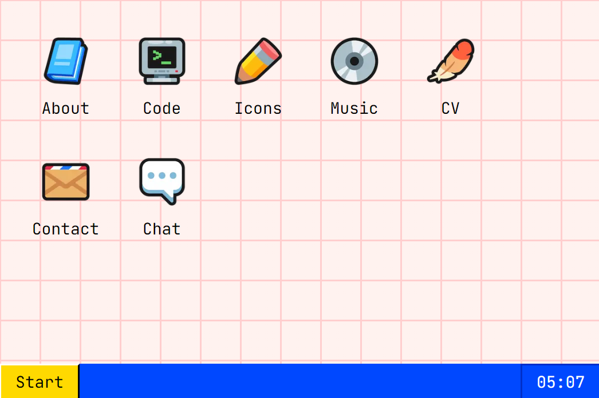

# Gloyens.co.uk

### Live website: [gloyens.co.uk](https://www.gloyens.co.uk)

## What is this project?

This is my personal portfolio! It's based on the Windows 95 OS, but with a few tweaks to give it some personality - [those icons were all made by me](https://rhosgfx.itch.io/vector-icon-pack), for example.

If you like the website, please leave some feedback in the `Chat` box!

## Aim

When I started making this portfolio, I'd been working at **[Phantom](https://phantom.land)** for just under a year and had just finished up work on **[Rmrkblty](https://www.rmrkblty.org)**. I&apos;d learned a huge amount in that time, and particularly in that last project, so I wanted to show off what I could do in a slightly flashier project. The lion&apos;s share of the work took about a week.

But perhaps the biggest reason I had to make this website was just to have fun. That&apos;s the reason I got into web development in the first place, after all, and it was really niice to make a low-stakes, frontend-focused website in a stack that I&apos;m familiar with.

Future projects will likely be a little more technically impressive, but for now this is my playground. 😊

## How it works

- 👷‍♂️ This site was made in **Next.js** and is hosted on **Vercel**. It uses **[CSS Components](https://css-components.net)** and **SASS** for styling.
- ✅ It is fully accessibly (though I&apos;m sure I&apos;ve missed something, so please let me know If you see anything), and has an average Lighthouse score of **98** on mobile and **98.75** on desktop.
- 💬 The Chat box functions via **[Cbox](https://www.cbox.ws)**.

## Future Plans

The site is largely finished, and besides adding case studies in the `Code` page, from the time of writing I will mostly be adding fun features and easter eggs. Current vague plans are as follows:

- Add the Konami code for... something?
- Add more functionality to the File/Edit/View menus
- Make resize handles easier to grab on mobile

As you can see, it's mostly fun stuff. But that's what this website is about. 😊

### Known Issues

- Wordle:
  - Word entry validation
  - Functional keyboard colours
